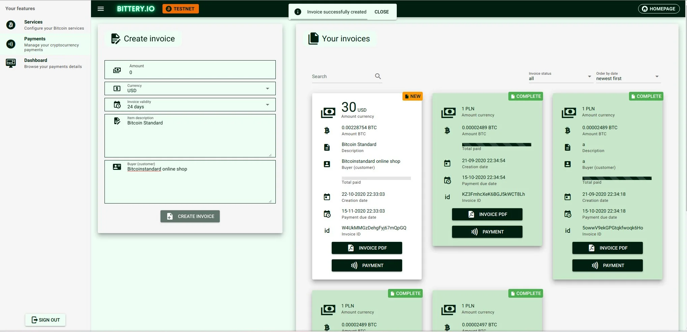
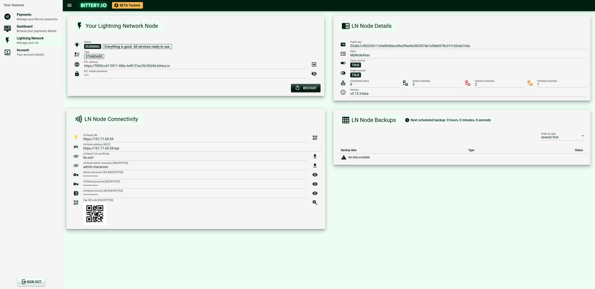
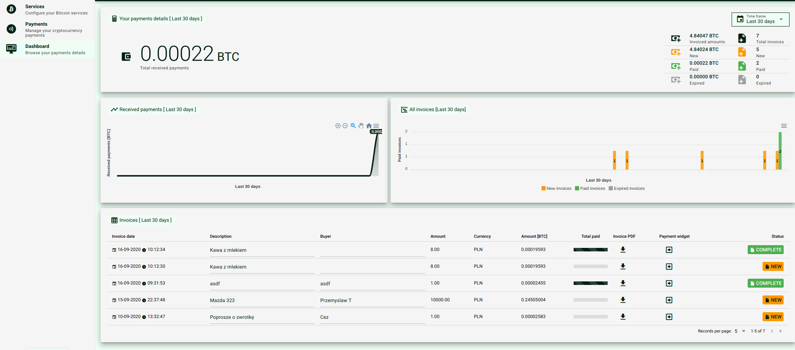

# Bittery (bittery-client)

Better Bitcoin payments UI



## Install the dependencies
```bash
nvm use v14.5.5
npm install
```

### Start the app in development mode (hot-code reloading, error reporting, etc.)
```bash
npm run dev
```

### Lint the files
```bash
npm run lint
```

### Build the app for production
```bash
npm run build
```

### Customize the configuration
See [Configuring quasar.conf.js](https://quasar.dev/quasar-cli/quasar-conf-js).
